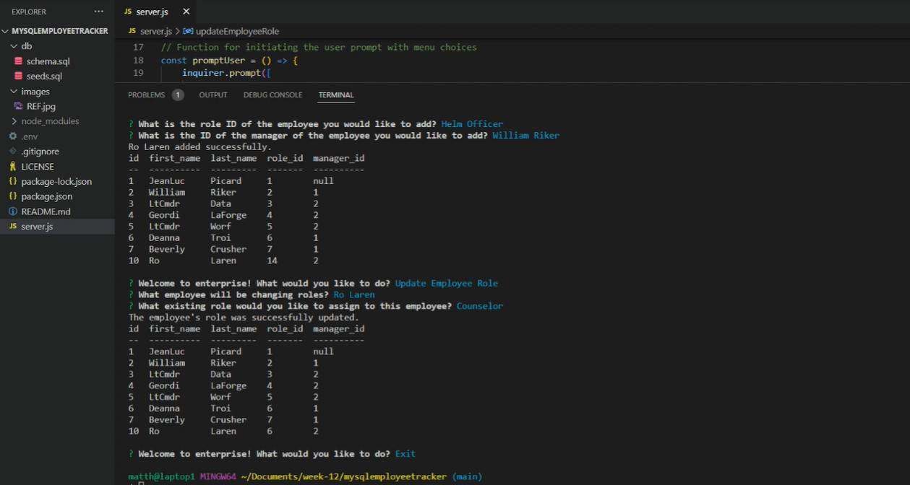

# mysqlemployeetracker

## Homework 12 MySQL: Employee Tracker 

This application allows the user to view and manage the departments, roles, and employees in a corporate directory so that the user can organize and plan business activities.

## Mock-up

## Installation

This application requires installation of npm, inquirer, mysql2, and console table. 

A walkthrough video can be viewed here: https://drive.google.com/file/d/1Ie_PSlHF2iVTjlILPOiY5SURn6iLRtJY/view

All elements of the project can be examined here: https://github.com/matthewestes33/mysqlemployeetracker

## Credits

Referenced documentation and tutorials:

mysql2 Using Promise Wrapper: https://www.npmjs.com/package/mysql2#using-promise-wrapper 

inquirer Objects: https://www.npmjs.com/package/inquirer#objects

MySQL UPDATE Statement: https://www.mysqltutorial.org/mysql-update-data.aspx 

Additional assistance:

Thank you to my instructional staff, weekly tutor, and AskBCS Learning Assistants!

## Features

When the user starts the command-line application, the application accepts user inputs and presents a menu of options.

The menu provides the user with the following options: view all departments, view all roles, view all employees, add a department, add a role, add an employee, and update an employee role.

When "View All Departments" is selected, the user is presented with a formatted table showing department names and department IDs. 

When "View All Roles" is selected, the user is presented with the job title, role id, the department that role belongs to, and the salary for that role.

When "View All Employees" is selected, the user is presented with a formatted table showing employee data, including employee IDs, first names, last names, job titles, departments, salaries, and direct reports.

When "Add A Department" is selected, the user is prompted to enter the name of the department and that department is added to the database.

When "Add A Role" is selected, the user is prompted to enter the name, salary, and department for the role and that role is added to the database.

When "Add An Employee" is selected, the user is prompted to enter the employee’s first name, last name, role, and manager, and that employee is added to the database.

WHEN "Update an Employee Role" is selected, the user is prompted to select an employee to update and their new role and this information is updated in the database. 

